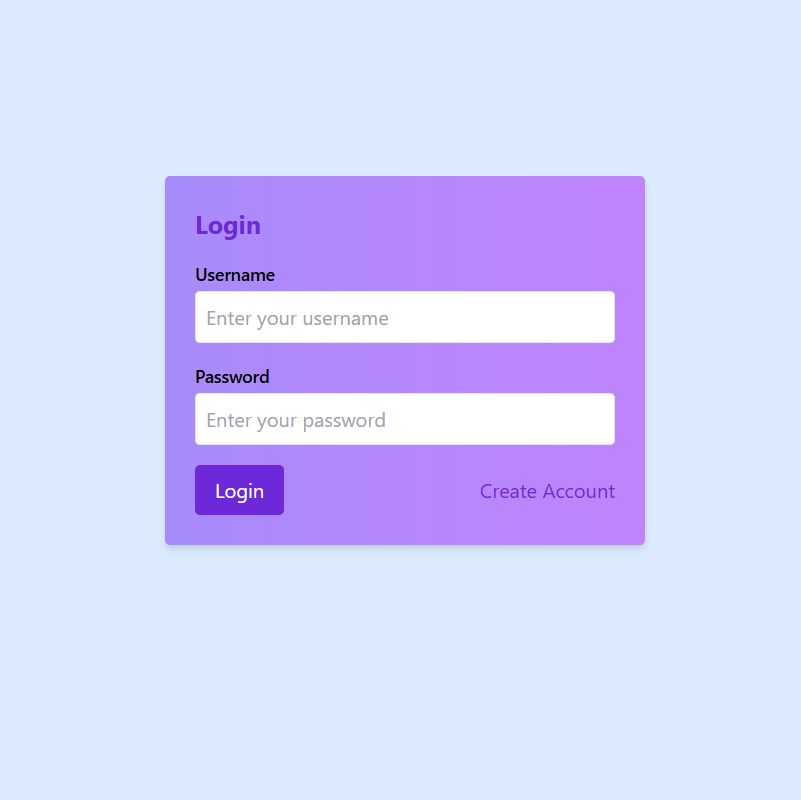
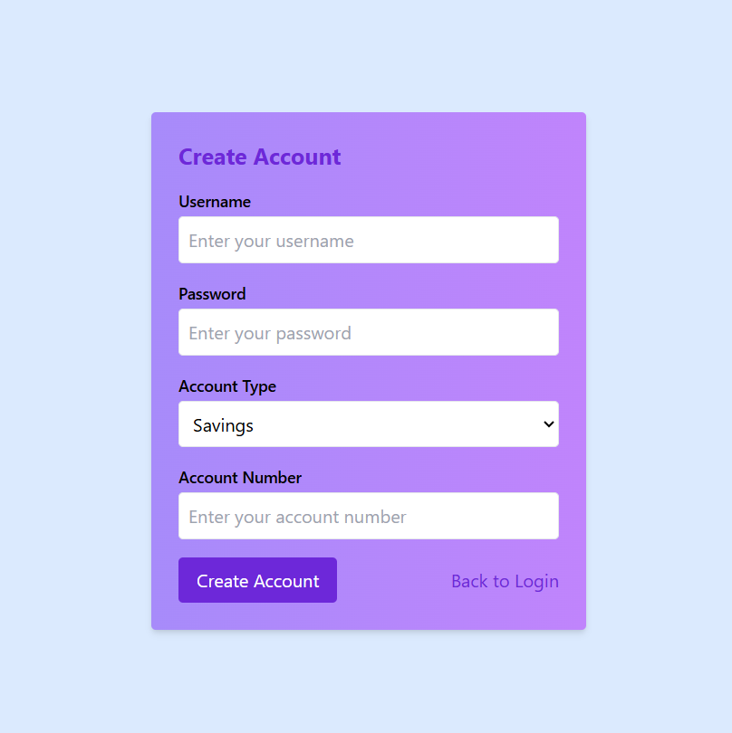
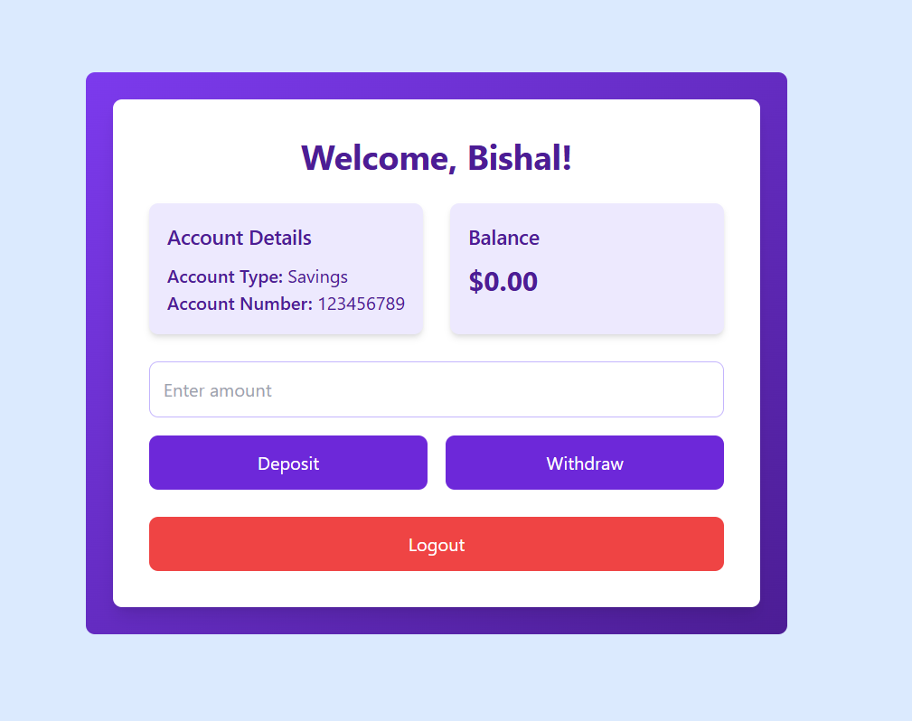

# 🏦 Basic Banking App

A simple and secure basic banking app built with **React** for learning and practicing core concepts like authentication, state management, and form handling.

🔗 **Live Demo**: [View App on Netlify](https://rbbankapp.netlify.app)


---

## 📸 Screenshots

> Add screenshots to the `screenshots/` folder and link them below.





---

## 🧠 Features

- 🔐 **Login & Signup**
  - Secure authentication for users
  - Form validation

- 💰 **Deposit**
  - Add funds to your account
  - Updates balance instantly

- 💸 **Withdraw**
  - Withdraw available funds
  - Prevents overdrawing

- 🧾 **Dashboard**
  - Shows current balance
  - Displays basic transaction summary

---

## 🧱 Tech Stack

- ⚛️ React (Vite)
- 🧠 React Hooks for state & form handling
- 🎨 Tailwind CSS or basic CSS for styling
- 🗂️ React Router (if used for navigation)

---

## 🚀 Getting Started

### 1. Clone the Repository

```bash
git clone https://github.com/your-username/your-repo-name.git
cd your-repo-name
